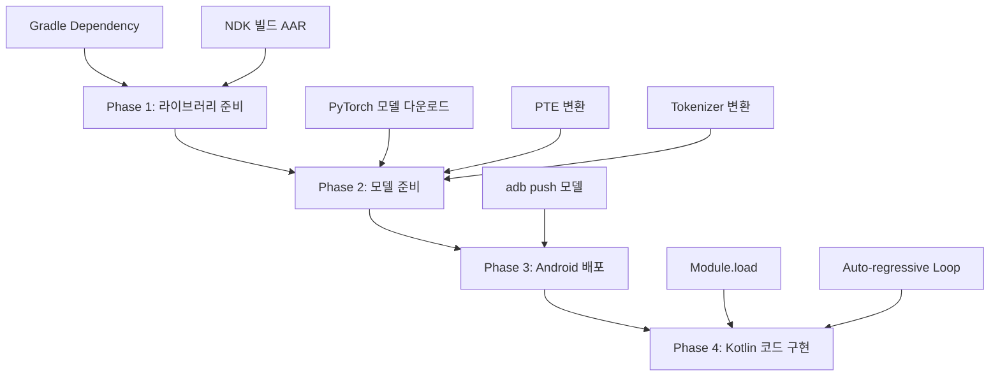

# ExecuTorch Android/AAOS 적용 가이드

## 📋 목차
1. [개요](#개요)
2. [전체 워크플로우](#전체-워크플로우)
3. [Phase 1: 라이브러리 준비](#phase-1-라이브러리-준비)
4. [Phase 2: 모델 준비](#phase-2-모델-준비)
5. [Phase 3: Android 배포](#phase-3-android-배포)
6. [Phase 4: Kotlin 코드 구현](#phase-4-kotlin-코드-구현)
7. [Backend 전략](#backend-전략)
8. [Clean Architecture 통합](#clean-architecture-통합)
9. [문제 해결](#문제-해결)

---

## 개요

### ExecuTorch란?
- PyTorch 모델을 모바일/임베디드 디바이스에서 실행하기 위한 런타임
- `.pte` (PyTorch ExecuTorch) 파일 포맷 사용
- LLM(Llama, Gemma 등)을 온디바이스에서 실행 가능

### 핵심 구성요소
```
┌─────────────────────────────────────────┐
│ Kotlin/Java App (Android/AAOS)         │
│   ↓ JNI                                 │
│ ExecuTorch Runtime (C++)                │
│   ↓ Backend                             │
│ XNNPACK / Vulkan / Qualcomm QNN        │
└─────────────────────────────────────────┘
```

### 주요 특징
- **Quantization**: INT4/INT8로 모델 크기 축소 (7B → ~2GB)
- **KV Cache**: Auto-regressive 생성 최적화
- **Multi-Backend**: CPU(XNNPACK), GPU(Vulkan), NPU(Qualcomm) 지원

---

## 전체 워크플로우



### 시간 소요 예상
- **Phase 1**: 2-4시간 (1회만)
- **Phase 2**: 1-2시간 (모델당 1회)
- **Phase 3**: 10분
- **Phase 4**: 개발 기간에 따라

---

## Phase 1: 라이브러리 준비

### 목표
- ExecuTorch Runtime을 Android에서 사용할 수 있도록 준비
- JNI Wrapper + Native Libraries (AAR 파일)

### Step 1-1: 시스템 요구사항

```bash
# 필수 설치
- Python 3.10-3.12
- Android NDK 26+
- CMake 3.19+
- Conda (권장)

# 환경 변수 설정
export ANDROID_NDK=$HOME/Library/Android/sdk/ndk/26.1.10909125
export ANDROID_HOME=$HOME/Library/Android/sdk
```

### Step 1-2: ExecuTorch 클론

```bash
git clone https://github.com/pytorch/executorch.git
cd executorch
git checkout viable/strict  # 안정 버전
```

### Step 1-3: NDK 빌드 (Custom AAR 생성)

#### Option A: 자동 스크립트 (권장)

```bash
cd examples/demo-apps/android/LlamaDemo
./setup.sh

# 결과: app/libs/executorch.aar 생성
```

#### Option B: 수동 빌드 (커스터마이징 필요시)

```bash
# 1. CMake Configure
cmake -S . -B cmake-out-android \
    -DCMAKE_TOOLCHAIN_FILE=$ANDROID_NDK/build/cmake/android.toolchain.cmake \
    -DANDROID_ABI=arm64-v8a \
    -DANDROID_PLATFORM=android-23 \
    -DCMAKE_BUILD_TYPE=Release \
    -DEXECUTORCH_BUILD_XNNPACK=ON \
    -DEXECUTORCH_BUILD_KERNELS_OPTIMIZED=ON \
    -DEXECUTORCH_BUILD_EXTENSION_MODULE=ON

# 2. Build
cmake --build cmake-out-android -j$(nproc) --target install

# 3. AAR 패키징
cd extension/android
./gradlew :executorch:assembleRelease

# 4. 결과물 확인
ls executorch/build/outputs/aar/executorch-release.aar
```

#### 생성된 AAR 구조

```
executorch.aar
├── jni/arm64-v8a/
│   ├── libexecutorch.so          # Core runtime
│   ├── libxnnpack_backend.so     # XNNPACK (CPU 최적화)
│   ├── liboptimized_ops_lib.so   # Neon SIMD kernels
│   └── libextension_module.so    # Module API
└── classes.jar                    # Java JNI wrapper
```

### Step 1-4: 프로젝트에 AAR 추가

```kotlin
// app/build.gradle.kts
android {
    defaultConfig {
        ndk {
            abiFilters += "arm64-v8a"
        }
    }
}

dependencies {
    // Custom AAR 사용
    implementation(files("libs/executorch.aar"))
}
```

### Step 1-5: AAR 검증

```bash
# AAR 압축 해제
unzip executorch.aar -d executorch-aar

# Native 라이브러리 확인
ls executorch-aar/jni/arm64-v8a/
# libexecutorch.so, libxnnpack_backend.so 등이 있어야 함
```

---

## Phase 2: 모델 준비

### 목표
- PyTorch 모델 → `.pte` 파일 변환
- Tokenizer → `.bin` 파일 변환

### Step 2-1: Python 환경 설정

```bash
# Conda 환경 생성
conda create -n executorch python=3.10
conda activate executorch

# ExecuTorch 설치
cd executorch
pip install -e .
./install_requirements.sh

# LLM export 의존성
pip install torch torchvision transformers
```

### Step 2-2: Llama 모델 다운로드

```bash
# HuggingFace CLI 설치
pip install huggingface-hub

# Llama 3.2 1B 다운로드 (예시)
huggingface-cli download \
    meta-llama/Llama-3.2-1B-Instruct \
    --local-dir ./llama-3.2-1b \
    --include "*.safetensors" "tokenizer.model" "*.json"

# 다운로드 결과:
# ./llama-3.2-1b/
# ├── model.safetensors
# ├── tokenizer.model
# ├── tokenizer_config.json
# └── config.json
```

### Step 2-3: PTE 변환 (Export + Quantization)

#### YAML 설정 파일 작성

```yaml
# config/llama3_2_1b_xnnpack.yaml
base:
  model_class: "llama3_2_1b"
  checkpoint: "~/llama-3.2-1b/model.safetensors"
  params: "~/llama-3.2-1b/config.json"

model:
  use_kv_cache: true
  use_sdpa_with_kv_cache: true
  max_seq_length: 2048

backend:
  xnnpack:
    enabled: true
    extended_ops: true

quantization:
  qmode: "8da4w"  # 8-bit dynamic activation + 4-bit weight
  group_size: 128

export:
  output_name: "llama3_2_1b.pte"
```

#### Export 실행

```bash
python -m extension.llm.export.export_llm \
    --config config/llama3_2_1b_xnnpack.yaml

# 결과: llama3_2_1b.pte (~500MB, INT4 quantized)
```

#### 명령줄 방식 (YAML 없이)

```bash
python -m extension.llm.export.export_llm \
    --checkpoint ~/llama-3.2-1b/model.safetensors \
    --params ~/llama-3.2-1b/config.json \
    --output_name llama3_2_1b.pte \
    --use_kv_cache \
    --use_sdpa_with_kv_cache \
    --xnnpack \
    --quantization 8da4w \
    --group_size 128 \
    --max_seq_length 2048
```

### Step 2-4: Tokenizer 변환 (선택사항)

```bash
# Llama 3.2는 tokenizer.model 직접 사용 가능
# 변환이 필요한 경우:
python -m pytorch_tokenizers.tools.llama2c.convert \
    -t ~/llama-3.2-1b/tokenizer.model \
    -o tokenizer.bin
```

### Step 2-5: Python Runtime 검증 (선택사항)

```python
from executorch.runtime import Runtime

# 모델 로드
runtime = Runtime.get()
program = runtime.load_program("llama3_2_1b.pte")
method = program.load_method("forward")

# 테스트 추론
import torch
input_tensor = torch.randint(0, 128256, (1, 10), dtype=torch.long)
output = method.execute([input_tensor])
print("✅ PTE 검증 성공!")
```

### Step 2-6: 빠른 방법 - Pre-exported PTE 다운로드

```bash
# HuggingFace에서 이미 export된 PTE 다운로드
huggingface-cli download \
    executorch-community/Llama-3.2-1B-Instruct-4bit-xnnpack \
    --local-dir ./models

# 결과:
# ./models/
# ├── llama3_2_1b.pte  (이미 export & quantized!)
# └── tokenizer.bin

# Step 2-3, 2-4를 건너뛸 수 있음
```

---

## Phase 3: Android 배포

### 목표
- PTE 파일과 Tokenizer를 Android 디바이스로 전송

### Step 3-1: 디바이스 연결 확인

```bash
adb devices
# List of devices attached
# 12345678    device
```

### Step 3-2: 디렉토리 생성 및 파일 업로드

```bash
# 디렉토리 생성
adb shell mkdir -p /data/local/tmp/llama

# 모델 & 토크나이저 업로드
adb push llama3_2_1b.pte /data/local/tmp/llama/
adb push tokenizer.bin /data/local/tmp/llama/

# 업로드 확인
adb shell ls -lh /data/local/tmp/llama/
# -rw-rw-rw- 1 shell shell 487M llama3_2_1b.pte
# -rw-rw-rw- 1 shell shell 500K tokenizer.bin
```

### Step 3-3: 권한 설정 (필요시)

```bash
adb shell chmod 644 /data/local/tmp/llama/*
```

### Step 3-4: Assets 번들링 (대안)

앱 빌드 시 포함하려면:

```kotlin
// app/src/main/assets/
assets/
├── models/
│   └── llama3_2_1b.pte
└── tokenizers/
    └── tokenizer.bin
```

```kotlin
// 런타임에 내부 저장소로 복사
private fun copyAssetsToInternalStorage() {
    val modelsDir = File(context.filesDir, "models")
    if (!modelsDir.exists()) {
        modelsDir.mkdirs()
        context.assets.open("models/llama3_2_1b.pte").use { input ->
            FileOutputStream(File(modelsDir, "llama3_2_1b.pte")).use { output ->
                input.copyTo(output)
            }
        }
    }
}
```

---

## Phase 4: Kotlin 코드 구현

### 목표
- ExecuTorch Module API로 LLM 추론 구현
- Auto-regressive 생성 루프 작성

### Step 4-1: 기본 추론 코드

```kotlin
// data/datasource/LlamaDataSource.kt
package com.example.aaos.data.datasource

import org.pytorch.executorch.Module
import org.pytorch.executorch.EValue
import org.pytorch.executorch.Tensor
import android.util.Log

class LlamaDataSource(
    private val ptePath: String,
    private val tokenizerPath: String
) {
    private val TAG = "LlamaDataSource"
    
    private val module: Module by lazy {
        Log.d(TAG, "Loading model from: $ptePath")
        Module.load(ptePath)
    }
    
    private val tokenizer: Tokenizer by lazy {
        Tokenizer.load(tokenizerPath)
    }
    
    /**
     * 텍스트 프롬프트로 응답 생성
     */
    fun generate(prompt: String, maxTokens: Int = 100): String {
        // 1. 프롬프트를 토큰 ID로 변환
        val inputTokens = tokenizer.encode(prompt).toMutableList()
        Log.d(TAG, "Input tokens: ${inputTokens.size}")
        
        // 2. Auto-regressive 생성
        repeat(maxTokens) { step ->
            // 2-1. 토큰 배열 → Long 텐서
            val inputArray = inputTokens.toLongArray()
            val inputTensor = Tensor.fromBlob(
                inputArray,
                longArrayOf(1, inputArray.size.toLong())
            )
            
            // 2-2. 모델 추론 실행
            val outputs = module.forward(EValue.from(inputTensor))
            val logits = outputs[0].toTensor().dataAsFloatArray
            
            // 2-3. 다음 토큰 샘플링
            val vocabSize = 128256  // Llama 3.2
            val lastLogits = logits.takeLast(vocabSize)
            val nextToken = sampleToken(lastLogits)
            
            // 2-4. EOS 토큰이면 종료
            if (nextToken == tokenizer.eosTokenId) {
                Log.d(TAG, "EOS reached at step $step")
                break
            }
            
            inputTokens.add(nextToken)
            
            if (step % 10 == 0) {
                Log.d(TAG, "Generated $step tokens")
            }
        }
        
        // 3. 토큰 ID를 텍스트로 디코딩
        return tokenizer.decode(inputTokens)
    }
    
    /**
     * 샘플링 전략 (Greedy)
     */
    private fun sampleToken(logits: List<Float>): Int {
        // Greedy sampling - 가장 확률 높은 토큰 선택
        return logits.indices.maxByOrNull { logits[it] } ?: 0
    }
    
    /**
     * Temperature Sampling (선택사항)
     */
    private fun sampleTokenWithTemperature(
        logits: List<Float>, 
        temperature: Float = 0.8f
    ): Int {
        val scaledLogits = logits.map { it / temperature }
        val expLogits = scaledLogits.map { kotlin.math.exp(it.toDouble()).toFloat() }
        val sumExp = expLogits.sum()
        val probs = expLogits.map { it / sumExp }
        
        // Categorical sampling
        val random = kotlin.random.Random.nextFloat()
        var cumSum = 0f
        for (i in probs.indices) {
            cumSum += probs[i]
            if (random < cumSum) return i
        }
        return probs.size - 1
    }
}
```

### Step 4-2: Tokenizer 구현

```kotlin
// data/tokenizer/Tokenizer.kt
package com.example.aaos.data.tokenizer

import java.io.File

interface Tokenizer {
    fun encode(text: String): List<Int>
    fun decode(tokens: List<Int>): String
    val eosTokenId: Int
    val bosTokenId: Int
    
    companion object {
        fun load(path: String): Tokenizer {
            // SentencePiece 또는 Tiktoken 구현
            return SentencePieceTokenizer(path)
        }
    }
}

class SentencePieceTokenizer(private val modelPath: String) : Tokenizer {
    // Native JNI 호출 또는 pure Kotlin 구현
    // 참고: https://github.com/google/sentencepiece
    
    override val eosTokenId: Int = 128001
    override val bosTokenId: Int = 128000
    
    override fun encode(text: String): List<Int> {
        // TODO: SentencePiece 구현
        return emptyList()
    }
    
    override fun decode(tokens: List<Int>): String {
        // TODO: SentencePiece 구현
        return ""
    }
}
```

### Step 4-3: Repository Layer (Clean Architecture)

```kotlin
// domain/repository/LLMRepository.kt
package com.example.aaos.domain.repository

import kotlinx.coroutines.flow.Flow

interface LLMRepository {
    suspend fun generateResponse(prompt: String): Flow<String>
    fun getSupportedBackends(): List<String>
}
```

```kotlin
// data/repository/LLMRepositoryImpl.kt
package com.example.aaos.data.repository

import com.example.aaos.data.datasource.LlamaDataSource
import com.example.aaos.domain.repository.LLMRepository
import kotlinx.coroutines.flow.Flow
import kotlinx.coroutines.flow.flow
import kotlinx.coroutines.Dispatchers
import kotlinx.coroutines.withContext

class LLMRepositoryImpl(
    private val llamaDataSource: LlamaDataSource
) : LLMRepository {
    
    override suspend fun generateResponse(prompt: String): Flow<String> = flow {
        val response = withContext(Dispatchers.Default) {
            llamaDataSource.generate(prompt, maxTokens = 100)
        }
        emit(response)
    }
    
    override fun getSupportedBackends(): List<String> {
        return listOf("XNNPACK", "Vulkan", "Qualcomm QNN")
    }
}
```

### Step 4-4: ViewModel (Compose)

```kotlin
// presentation/viewmodel/ChatViewModel.kt
package com.example.aaos.presentation.viewmodel

import androidx.lifecycle.ViewModel
import androidx.lifecycle.viewModelScope
import com.example.aaos.domain.repository.LLMRepository
import kotlinx.coroutines.flow.MutableStateFlow
import kotlinx.coroutines.flow.asStateFlow
import kotlinx.coroutines.launch

class ChatViewModel(
    private val repository: LLMRepository
) : ViewModel() {
    
    private val _response = MutableStateFlow("")
    val response = _response.asStateFlow()
    
    private val _isLoading = MutableStateFlow(false)
    val isLoading = _isLoading.asStateFlow()
    
    fun sendPrompt(prompt: String) {
        viewModelScope.launch {
            _isLoading.value = true
            _response.value = ""
            
            try {
                repository.generateResponse(prompt).collect { text ->
                    _response.value = text
                }
            } catch (e: Exception) {
                _response.value = "Error: ${e.message}"
            } finally {
                _isLoading.value = false
            }
        }
    }
}
```

### Step 4-5: Compose UI

```kotlin
// presentation/ui/ChatScreen.kt
package com.example.aaos.presentation.ui

import androidx.compose.foundation.layout.*
import androidx.compose.material3.*
import androidx.compose.runtime.*
import androidx.compose.ui.Modifier
import androidx.compose.ui.unit.dp

@Composable
fun ChatScreen(viewModel: ChatViewModel) {
    val response by viewModel.response.collectAsState()
    val isLoading by viewModel.isLoading.collectAsState()
    
    var userInput by remember { mutableStateOf("") }
    
    Column(
        modifier = Modifier
            .fillMaxSize()
            .padding(16.dp)
    ) {
        // Response display
        Card(
            modifier = Modifier
                .weight(1f)
                .fillMaxWidth()
        ) {
            Text(
                text = response.ifEmpty { "Response will appear here..." },
                modifier = Modifier.padding(16.dp)
            )
        }
        
        Spacer(modifier = Modifier.height(16.dp))
        
        // Input field
        OutlinedTextField(
            value = userInput,
            onValueChange = { userInput = it },
            modifier = Modifier.fillMaxWidth(),
            label = { Text("Enter your prompt") },
            enabled = !isLoading
        )
        
        Spacer(modifier = Modifier.height(8.dp))
        
        // Send button
        Button(
            onClick = {
                viewModel.sendPrompt(userInput)
                userInput = ""
            },
            modifier = Modifier.fillMaxWidth(),
            enabled = !isLoading && userInput.isNotBlank()
        ) {
            if (isLoading) {
                CircularProgressIndicator(
                    modifier = Modifier.size(24.dp),
                    color = MaterialTheme.colorScheme.onPrimary
                )
            } else {
                Text("Send")
            }
        }
    }
}
```

### Step 4-6: Dependency Injection (Hilt)

```kotlin
// di/AppModule.kt
@Module
@InstallIn(SingletonComponent::class)
object AppModule {
    
    @Provides
    @Singleton
    fun provideLlamaDataSource(
        @ApplicationContext context: Context
    ): LlamaDataSource {
        val ptePath = "/data/local/tmp/llama/llama3_2_1b.pte"
        val tokenizerPath = "/data/local/tmp/llama/tokenizer.bin"
        return LlamaDataSource(ptePath, tokenizerPath)
    }
    
    @Provides
    @Singleton
    fun provideLLMRepository(
        dataSource: LlamaDataSource
    ): LLMRepository {
        return LLMRepositoryImpl(dataSource)
    }
}
```

---

## Backend 전략

### Backend란?
ExecuTorch가 모델을 실행할 하드웨어를 선택하는 방식

### 지원 Backend

| Backend | 타겟 | 특징 | 성능 |
|---------|------|------|------|
| **XNNPACK** | CPU (Arm, x86) | 범용, 안정적 | 5-10 tokens/sec |
| **Vulkan** | GPU | GPU 가속 | 8-15 tokens/sec |
| **Qualcomm QNN** | Snapdragon NPU | 최고 성능 | 15-25 tokens/sec |
| **MediaTek** | Dimensity APU | MediaTek 전용 | 12-20 tokens/sec |
| **CoreML** | iOS Neural Engine | Apple 전용 | 20-30 tokens/sec |

### Backend 설정 3단계

#### 1️⃣ PTE Export 시 Backend 지정

```yaml
# config/llama_xnnpack.yaml
backend:
  xnnpack:
    enabled: true
    extended_ops: true
```

```yaml
# config/llama_vulkan.yaml
backend:
  vulkan:
    enabled: true
```

```yaml
# config/llama_qnn.yaml
backend:
  qnn:
    enabled: true
    soc_model: "SM8550"  # Snapdragon 8 Gen 2
```

#### 2️⃣ NDK 빌드 시 Backend 컴파일

```bash
# XNNPACK만
cmake -DEXECUTORCH_BUILD_XNNPACK=ON

# Vulkan 추가
cmake -DEXECUTORCH_BUILD_XNNPACK=ON \
      -DEXECUTORCH_BUILD_VULKAN=ON

# Qualcomm QNN 추가
cmake -DEXECUTORCH_BUILD_QNN=ON \
      -DQNN_SDK_ROOT=/path/to/qnn/sdk
```

#### 3️⃣ Runtime 로드 (자동)

```kotlin
// PTE 파일에 backend 정보가 임베드되어 있어서 자동 선택
val module = Module.load("/path/to/llama_xnnpack.pte")  // XNNPACK 사용
val module = Module.load("/path/to/llama_qnn.pte")      // QNN 사용
```

### 권장 전략: Multi-Backend 지원

#### 디바이스별 Backend 감지

```kotlin
// data/backend/BackendDetector.kt
object BackendDetector {
    
    enum class Backend(val pteFileName: String) {
        QUALCOMM("llama_qnn.pte"),
        VULKAN("llama_vulkan.pte"),
        XNNPACK("llama_xnnpack.pte")
    }
    
    fun detectBestBackend(): Backend {
        val soc = getSocModel()
        
        return when {
            isQualcommDevice(soc) -> Backend.QUALCOMM
            supportsVulkan() -> Backend.VULKAN
            else -> Backend.XNNPACK
        }
    }
    
    private fun getSocModel(): String {
        return try {
            val process = Runtime.getRuntime()
                .exec("getprop ro.board.platform")
            process.inputStream.bufferedReader().readText().trim()
        } catch (e: Exception) {
            "unknown"
        }
    }
    
    private fun isQualcommDevice(soc: String): Boolean {
        return soc.lowercase().startsWith("sm8") ||  // Snapdragon 8
               soc.lowercase().startsWith("kalama")   // Chipset codename
    }
    
    private fun supportsVulkan(): Boolean {
        return File("/system/lib64/libvulkan.so").exists()
    }
}
```

#### Fallback Chain 구현

```kotlin
fun selectBackendWithFallback(modelsDir: String): Backend {
    val priority = listOf(
        Backend.QUALCOMM,  // 최고 우선순위
        Backend.VULKAN,
        Backend.XNNPACK    // Fallback
    )
    
    for (backend in priority) {
        val ptePath = "$modelsDir/${backend.pteFileName}"
        if (File(ptePath).exists()) {
            Log.i(TAG, "Selected: ${backend.name}")
            return backend
        }
    }
    
    return Backend.XNNPACK  // 최후의 fallback
}
```

### AAOS 권장 구성

```bash
# 1. XNNPACK (필수 - 모든 디바이스)
python -m extension.llm.export.export_llm \
    --config config/llama_xnnpack.yaml

# 2. Qualcomm (선택 - Snapdragon 디바이스)
python -m extension.llm.export.export_llm \
    --config config/llama_qnn.yaml

# 결과:
# llama_xnnpack.pte  (~500MB) - Fallback
# llama_qnn.pte      (~450MB) - Snapdragon 최적화
```

---

## Clean Architecture 통합

### 프로젝트 구조

```
app/
├── data/
│   ├── datasource/
│   │   └── LlamaDataSource.kt          # ExecuTorch Module 래퍼
│   ├── repository/
│   │   └── LLMRepositoryImpl.kt
│   ├── backend/
│   │   └── BackendDetector.kt
│   └── tokenizer/
│       └── Tokenizer.kt
├── domain/
│   ├── repository/
│   │   └── LLMRepository.kt
│   └── usecase/
│       └── GenerateResponseUseCase.kt
└── presentation/
    ├── viewmodel/
    │   └── ChatViewModel.kt
    └── ui/
        └── ChatScreen.kt
```

### Layer별 책임

#### Data Layer
```kotlin
// ExecuTorch와 직접 상호작용
class LlamaDataSource(ptePath: String, tokenizerPath: String) {
    private val module = Module.load(ptePath)
    fun generate(prompt: String): String { /* ... */ }
}
```

#### Domain Layer
```kotlin
// 비즈니스 로직, 플랫폼 독립적
interface LLMRepository {
    suspend fun generateResponse(prompt: String): Flow<String>
}

class GenerateResponseUseCase(private val repository: LLMRepository) {
    suspend operator fun invoke(prompt: String) = 
        repository.generateResponse(prompt)
}
```

#### Presentation Layer
```kotlin
// UI 상태 관리
class ChatViewModel(private val useCase: GenerateResponseUseCase) {
    val response = MutableStateFlow("")
    fun sendPrompt(prompt: String) { /* ... */ }
}
```

---

## 문제 해결

### 일반적인 오류

#### 1. `Module.load()` 실패

```
Error: Failed to load model from /path/to/model.pte
```

**해결책:**
```kotlin
// 파일 존재 확인
val pteFile = File(ptePath)
if (!pteFile.exists()) {
    Log.e(TAG, "PTE file not found: $ptePath")
    // assets에서 복사 또는 다운로드
}

// 권한 확인
if (!pteFile.canRead()) {
    Log.e(TAG, "No read permission for: $ptePath")
}
```

#### 2. Backend 미지원

```
Error: XnnpackBackend not found
```

**해결책:**
- NDK 빌드 시 해당 backend를 컴파일했는지 확인
- AAR 내부에 `libxnnpack_backend.so` 존재 확인

```bash
unzip -l executorch.aar | grep xnnpack
# jni/arm64-v8a/libxnnpack_backend.so 있어야 함
```

#### 3. Out of Memory

```
Error: Failed to allocate tensor memory
```

**해결책:**
- 더 작은 모델 사용 (1B → 500MB)
- Quantization 강화 (INT8 → INT4)
- `max_seq_length` 축소

```yaml
model:
  max_seq_length: 1024  # 2048 → 1024로 축소
```

#### 4. 느린 추론 속도

**최적화 방법:**
1. KV Cache 활성화 확인
2. SDPA 활성화 확인
3. Backend 최적화 (QNN > Vulkan > XNNPACK)
4. Batch size 조정

```yaml
model:
  use_kv_cache: true              # 필수
  use_sdpa_with_kv_cache: true    # 필수
```

### 디버깅 팁

#### Logcat 필터링

```bash
# ExecuTorch 로그만 보기
adb logcat | grep -i executorch

# 에러만 보기
adb logcat *:E | grep -i executorch
```

#### PTE 파일 검증

```python
from executorch.devtools.etrecord import parse_etrecord

# PTE 메타데이터 확인
record = parse_etrecord("llama3_2_1b.pte")
print(f"Backend: {record.backend}")
print(f"Operators: {record.operators}")
print(f"Memory: {record.memory_usage}")
```

#### 성능 프로파일링

```kotlin
class PerformanceMonitor {
    fun measureInference(block: () -> Unit): Long {
        val start = System.currentTimeMillis()
        block()
        val end = System.currentTimeMillis()
        return end - start
    }
}

// 사용
val latency = monitor.measureInference {
    module.forward(input)
}
Log.d(TAG, "Inference latency: ${latency}ms")
```

---

## 체크리스트

### 개발 환경 설정 (1회)
- [ ] Android NDK 설치
- [ ] Python 3.10+ & Conda 환경
- [ ] ExecuTorch 클론
- [ ] Custom AAR 빌드 성공

### 모델 준비 (모델당 1회)
- [ ] PyTorch 모델 다운로드 (HuggingFace)
- [ ] PTE로 export (quantization)
- [ ] Tokenizer 변환 또는 확보
- [ ] Python runtime 검증

### Android 통합
- [ ] AAR을 프로젝트에 추가
- [ ] PTE 파일 디바이스에 업로드
- [ ] Tokenizer 파일 디바이스에 업로드
- [ ] 파일 권한 확인

### 코드 구현
- [ ] LlamaDataSource 구현
- [ ] Tokenizer 인터페이스 구현
- [ ] Repository & UseCase 구현
- [ ] ViewModel & Compose UI 구현
- [ ] Dependency Injection 설정

### 최적화 (선택)
- [ ] Multi-backend 지원
- [ ] Backend 자동 감지
- [ ] KV Cache 활성화
- [ ] 성능 모니터링

---

## 참고 자료

### 공식 문서
- [ExecuTorch 공식 문서](https://pytorch.org/executorch/stable/)
- [Getting Started Guide](https://pytorch.org/executorch/main/getting-started.html)
- [Llama Example](https://github.com/pytorch/executorch/tree/main/examples/models/llama)
- [Android 통합 가이드](https://pytorch.org/executorch/main/using-executorch-android.html)

### HuggingFace 리소스
- [Pre-exported PTE 모델](https://huggingface.co/executorch-community)
- [Optimum-ExecuTorch](https://github.com/huggingface/optimum-executorch)

### 예제 코드
- [Android Llama Demo](https://github.com/pytorch/executorch/tree/main/examples/demo-apps/android/LlamaDemo)
- [ExecuTorch Examples](https://github.com/pytorch/executorch/tree/main/examples)

---

## 다음 단계

### Phase 1 완료 후
✅ AAR 빌드 성공
→ Phase 2로 진행 (모델 준비)

### Phase 2 완료 후
✅ PTE 파일 생성
→ Phase 3으로 진행 (디바이스 배포)

### Phase 3 완료 후
✅ 파일 업로드 완료
→ Phase 4로 진행 (코드 구현)

### Phase 4 완료 후
✅ 기본 추론 동작
→ 최적화 단계:
- Multi-backend 지원
- Streaming 응답
- 메모리 최적화
- UI/UX 개선

---

## 시간 절약 팁

### 빠른 프로토타입
1. Pre-exported PTE 사용 (Phase 2 스킵)
2. Maven AAR 사용 (Phase 1 간소화)
3. XNNPACK만 사용 (Backend 단순화)

```bash
# 1시간 안에 프로토타입
# 1. Maven AAR (build.gradle.kts)
implementation("org.pytorch:executorch-android:0.4.0")

# 2. Pre-exported PTE 다운로드
huggingface-cli download executorch-community/Llama-3.2-1B

# 3. adb push
adb push llama3_2_1b.pte /data/local/tmp/

# 4. Kotlin 코드 작성
Module.load("/data/local/tmp/llama3_2_1b.pte")
```

### 프로덕션 준비
1. Custom NDK 빌드 (최적화)
2. Multi-backend 지원
3. Backend 자동 감지
4. 에러 핸들링 & 로깅

---

## 추가 고려사항

### AAOS 특화
- 차량 환경에서의 메모리 제약
- 온도/진동에 따른 성능 변화
- 안전 운전을 위한 응답 시간 최적화
- 오프라인 동작 보장

### 보안
- PTE 파일 암호화 (AES)
- 사용자 프롬프트 로깅 정책
- 디바이스 내 데이터 보호

### 사용자 경험
- 첫 응답 시간 (TTFT) 최소화
- 스트리밍 응답 (토큰 단위)
- 백그라운드 초기화
- 오류 시 친절한 메시지

---

**작성일**: 2025-11-05  
**ExecuTorch 버전**: 0.4.0  
**대상 플랫폼**: Android/AAOS (Arm64)

모델 추천)
https://huggingface.co/Motif-Technologies/Motif-2.6b-v1.1-LC
